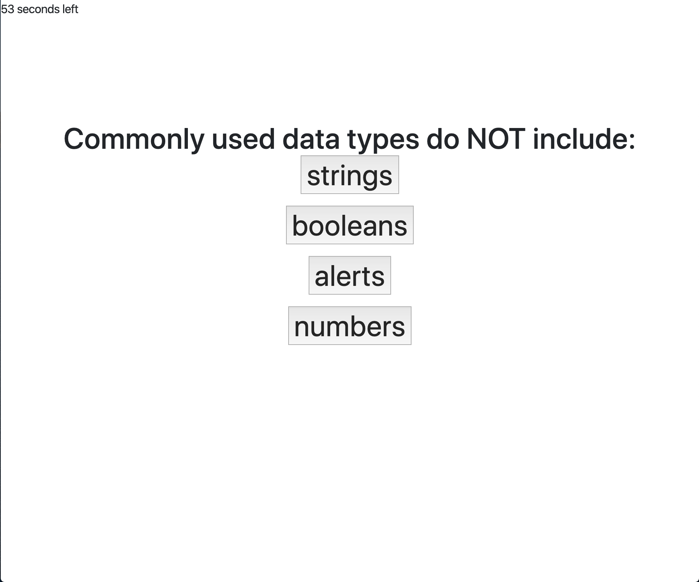

# HW4-Code-Quiz
My repository for the HW4-CodeQuiz assignment.

1) Description: This application contains 5 questions about Javascript and has a 1 minute time limit.  Each time the user clicks a wrong answer, they lose 10 seconds on the clock.  No matter what answer buttons you click, you always move on to the next question.  At the end, the number of questions you got right is tallied up and the user is prompted to enter their username into the leaderboard.  The user's entered initials and score are saved to localStorage and displayed alongside other users who took the quiz in a leaderboard at the end.

2) Deployed Application:  https://bkim377.github.io/HW4-Code-Quiz/

3) Image: 